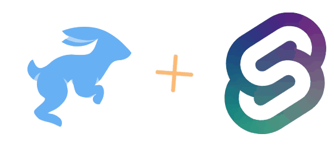

# Directus Sveltekit Blogging Starter

This is a Directus, Sveltekit blogging starter. Also comes with Tailwind (via Windicss) for easy styling!

## Example

## Getting Started
1. `git clone https://github.com/alteredorange/directus-sveltekit-blog-starter.git starter`
2. `cd starter`
3. `pnpm i    //or 'npm i' or 'yarn'`
4. `pnpm run dev` - This will start Directus on the standard port (http://localhost:8055) and Sveltekit on http://localhost:3000
5. Visit the Directus dashboard to add posts
6. Edit any styles or pages directly through the Sveltekit files

## Improvements and Suggestions
Running into issues or have a suggestion to make things better? Feel free to open up an issue, pull request, or github discussion!
